<div align="center">

<!-- HERO PANEL -->
<a href="https://github.com/ImamWahyudiz">
  
</a>

<br><br>

<table width="100%" cellspacing="0" cellpadding="0" border="0">
  <tr>
    <td width="60%" valign="top">
      <!-- ABOUT PANEL -->
      
      <br><br>
```python
class ImamWahyudi:
    name = "Imam Wahyudi"
    role = "Software Developer"
    hardware = ["ESP32", "KY-003", "KY-027"]
    focus = ["Data Structures", "IoT", "Web"]
```
      <br>
      <b>Mission:</b> Building robust technology that solves real-world problems. Always learning something new! 🌱
    </td>
    <td width="5%"></td>
    <td width="35%" valign="top" align="center">
      <!-- BADGE PANEL -->
      
      <br><br><i>(Click to flip!)</i><br>
      <a href="#">
        
      </a>
    </td>
  </tr>
</table>

<br><br>

<!-- TECH PANEL -->

<br><br>
<p align="center">
  
  
  
  
  
  
  
  
</p>

<br>

<!-- STATS PANEL -->
<table width="100%" cellspacing="0" cellpadding="0" border="0">
  <tr>
    <td width="48%" valign="top">
      
      <br><br>
      
    </td>
    <td width="4%"></td>
    <td width="48%" valign="top">
      
      <br><br>
      
    </td>
  </tr>
</table>

<br>


<br><br>
<picture>
  <source media="(prefers-color-scheme: dark)" srcset="https://raw.githubusercontent.com/ImamWahyudiz/ImamWahyudiz/output/github-snake-dark.svg" />
  <source media="(prefers-color-scheme: light)" srcset="https://raw.githubusercontent.com/ImamWahyudiz/ImamWahyudiz/output/github-snake.svg" />
  
</picture>

</div>
