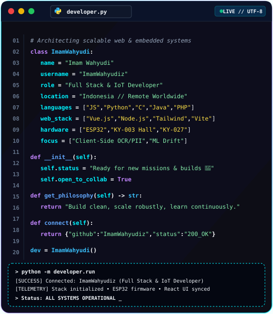
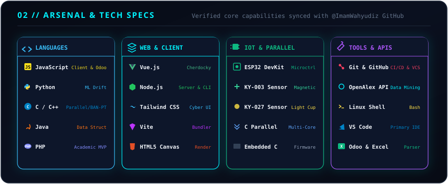
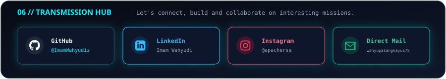

<!-- Custom Cyber HUD Header Banner -->

 

<!-- Interactive Typing SVG -->

 

<!-- Live Buttons & Badges -->

&nbsp;

&nbsp;

---

<!-- Side by Side: About Code Terminal + 3D Lanyard ID Card -->
<table width="100%" border="0">
<tr>
<td width="60%" valign="top" align="center">

</td>
<td width="40%" valign="top" align="center">

</td>
</tr>
</table>

---

<!-- Custom Tech Matrix Banner -->

  

---

<!-- GitHub Telemetry & Stats -->

### 📊 GitHub Telemetry & Activity

  

  

<!-- Snake Eating Contributions Animation -->
<picture>
  <source media="(prefers-color-scheme: dark)" srcset="https://raw.githubusercontent.com/ImamWahyudiz/ImamWahyudiz/output/github-snake-dark.svg" />
  <source media="(prefers-color-scheme: light)" srcset="https://raw.githubusercontent.com/ImamWahyudiz/ImamWahyudiz/output/github-snake.svg" />
  
</picture>

---

<!-- Connect & Social Hub Banner -->

  

